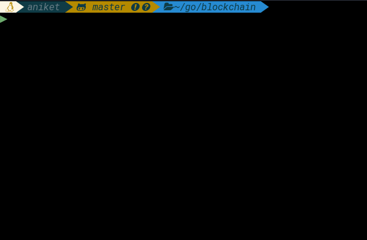

## Blockchain-implementation

An implementation of blockchain in Golang.

## Demo
Initial (now redundant) approach was to store the Blocks containing SHA-256
Hashes of the current and previous blocks along with the data (usually the
transactions).

Later revisions added a CLI support using Golang's builtin `os.Args` package.

<p float="left">
  
  
</p>

### Hashing algorithm

Current restriction on calculating hashes is to have a certain length of 0s (18 as of now, see [here](https://www.blockchain.com/btc/block/000000000000000000e907ebdb890c7f46c0649829b60e98ff5cb5e2b83fcc77)) in the beginning of a hash value. However, it is technically impossible
to calculate reasonable amount of hashes in a minute (generally takes years). Keeping
that in mind, I've set the limit to be 4 0s.

The hash functions repeatedly calculates the hashes in order until it finds one
which satisfies the restriction.

``` Go
for nonce < maxNonce {
	/* Retrieve the data for given PoW */
	data := pow.prepareData(nonce)
	/* Calculate it's SHA hash */
	hash := sha256.Sum256(data)
	fmt.Printf("\r%x", hash)
	hashInt.SetBytes(hash[:])

	/* If the calculated hash was less than target then we exit */
	if hashInt.Cmp(pow.target) == -1 {
		fmt.Printf("\n\n")
		return nonce, hash[:]
	} else {
		nonce++
	}
}
```
The `nonce` is incremented after each iteration to inculcate the randomness in
hash generation.

### Block structure

The `block` structure defined as follows.
``` Go
type Block struct {
       Timestamp  	int64		/* Time of block creation */
       Data		[]byte		/* Valuable info in the block */
       PrevBlockHash	[]byte		/* Hash of the previous block */
       Hash 		[]byte		/* Hash of the block */
       Nonce		int		/* Random nonce for PoW */
}
```

### Proof of Work
POF is important in a sense that it enables us to validate whether the existing
transactions are frivolous or are they actually correct. The Proof of Work algorithm
validates whether the individual instances of every block satisfies the length
restriction and that the sha256 of its data and timestamp is correct.

This is what the output looks like in case all transactions are valid.

``` bash
Prev. Hash:
Data: Genesis Block
Hash: 0000182b35b041c153730f35b0a4028316b83b865c19fd8feb7354d3df4adf85
Valid PoW: true

Prev. Hash: 0000182b35b041c153730f35b0a4028316b83b865c19fd8feb7354d3df4adf85
Data: Send 1 BTC to Lavannya
Hash: 0000006973f8dd0f5bfd0563bb2ed605f78924f0ba7f78de48b7b0810c87d94c
Valid PoW: true

Prev. Hash: 0000006973f8dd0f5bfd0563bb2ed605f78924f0ba7f78de48b7b0810c87d94c
Data: Send 2 more BTC to Lavannya
Hash: 000019f7bb6130f5ffcc9bd632622ee2c51c062090984f8cae1046d97858c589
Valid PoW: true

Prev. Hash: 000019f7bb6130f5ffcc9bd632622ee2c51c062090984f8cae1046d97858c589
Data: Send 1 Heart to Apoorva
Hash: 00000c2de9cb0d1b686b8590925e9b7975eaf125b1ac5269d490c6cdfcf321d8
Valid PoW: true

Prev. Hash: 00000c2de9cb0d1b686b8590925e9b7975eaf125b1ac5269d490c6cdfcf321d8
Data: Send 2 more Hearts to Apoorva
Hash: 00001a90377b8d605b7ec4fe4e794d9af80ee559bd3f731cfc14bce596e3dd63
Valid PoW: true

Prev. Hash: 00001a90377b8d605b7ec4fe4e794d9af80ee559bd3f731cfc14bce596e3dd63
Data: Send 1 more BTC to Lavannya
Hash: 0000174cb32178ef254fe3286ca60cfc449890ac347862a3e0b663404c4717ef
Valid PoW: true

```

## Blockchain-CLI

The functionality to create custom transactions and store them as a ledger was
introduced after [66b9b8d](https://github.com/aniketp/blockchain/tree/66b9b8d9d4728b12bd4bb8a940f9fd6ea6485163).

### Dependencies
```
 $ go get github.com/boltdb/bolt
 $ go get github.com/eiannone/keyboard
```

### Usage
``` bash
Usage: blockchain [addblock] [printchain ...]
```
Initialize a blockchain database. Then add blocks or view the existing records.
``` bash
 ▶ ./blockchain addblock -data "Gangadhar he Shaktimaan hai"
 Mining the block containing "Genesis Block"
 00001296932b2c21660b44e6d61e90f2b8733ea6de3cd50ab605acdfc4499e49

 Mining the block containing "Gangadhar he Shaktimaan hai"
 000010f6cd380c3440cb0d9254f044569e4c67f444306d709f3c70180b4fff32

 Success!
```
``` bash
 ▶ ./blockchain printchain
 Prev. hash: 00001296932b2c21660b44e6d61e90f2b8733ea6de3cd50ab605acdfc4499e49
 Data: Gangadhar he Shaktimaan hai
 Hash: 000010f6cd380c3440cb0d9254f044569e4c67f444306d709f3c70180b4fff32
 PoW: true

 Prev. hash:
 Data: Genesis Block
 Hash: 00001296932b2c21660b44e6d61e90f2b8733ea6de3cd50ab605acdfc4499e49
 PoW: true

```
